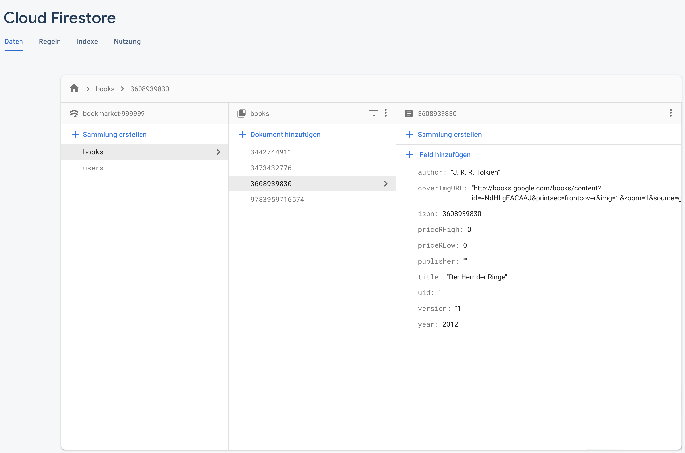
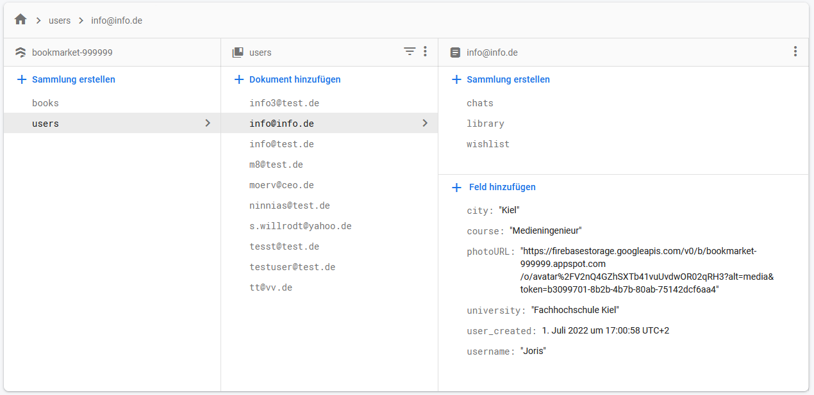
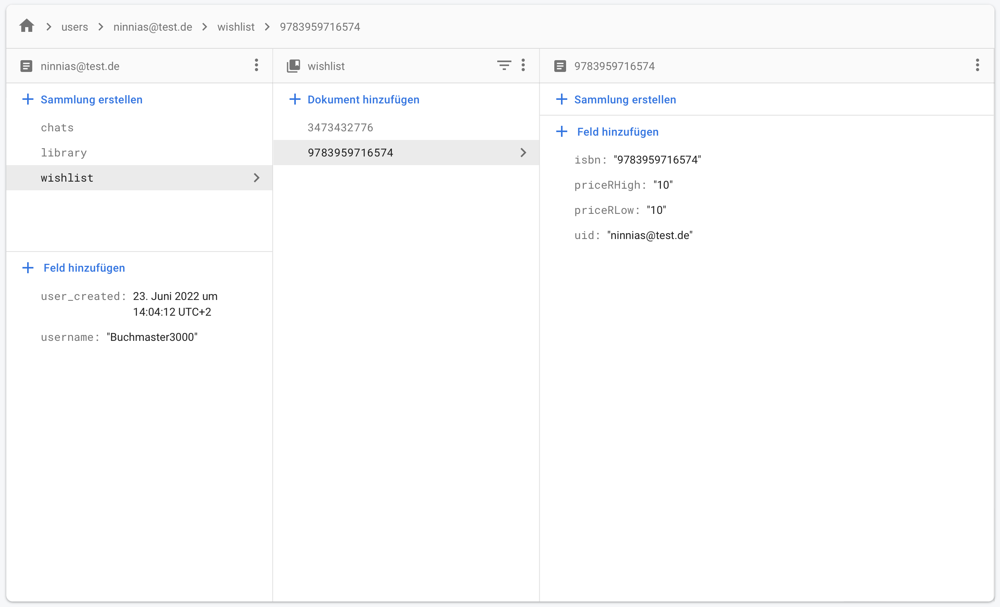
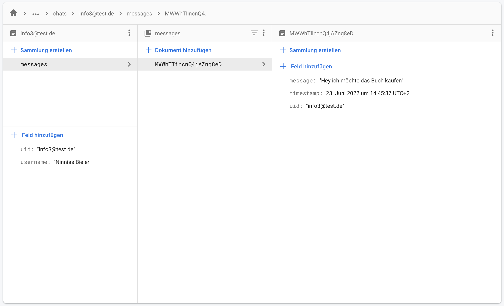

# Firebase

Für dieses Projekt nutzen wir zum Speichern von Daten die ["Cloud Firestore"](#cloud-firestore)-Datenbank von [Firebase/Google](https://firebase.google.com/). Weitere Produkte, die ebenfalls in unserem Projekt verwendet werden, sind ["Storage"](#storage) und ["Authentication"](#authentication).

## Cloud Firestore

Um möglichst wenige Duplikate in der Datenbank abzuspeichern und eher auf andere Objekte referenzieren, haben wir auf der ersten Ebene zwei Sammlungen angelegt:
1. [books](#books-sammlung) (globaler Speicher aller angelegten Bücher in der App)
1. [users](#users-sammlung) (Speicher aller Nutzerdaten)

Die Anwendung greift auf beide Sammlungen zu und kombiniert die angegebenen Daten miteinander, sodass z.B. später in der Anwendung die richtigen Bücherinformationen in der Wunschliste auftauchen.

### Books-Sammlung

Jedes Buch (ob mit der [API](./API.md) gesucht, bzw. manuell im Formular eingetragen) wird mit der jeweiligen ISBN als Identifikator in unserer Datenbank abgespeichert. In der App wurde implementiert,
dass nur Bücher mit bisher \"unbekannten\" ISBN-Nummern neu hinzugefügt werden. Informationen zu bereits bekannten Büchern werden nicht durch abweichende Angaben upgedatet, um Missbrauch durch
Falschinformationen im Formular einzuschränken. Zu den abgespeicherten Datenfeldern pro Buch gehören Angaben zu:
* ISBN `isbn`
* Coverbild URL `coverImgURL`
* Titel `title`
* Autor `author`
* Herausgabejahr  `year`

Angaben zum Preisbereich (`priceRLow`,`priceRHigh`) und der Userid/E-Mailadresse(`uid`) entstammen der angelegten Bücherklasse in der Anwendung und werden wie bereits beschrieben auf den jeweiligen Seiten um diese Angaben erweitert.
Diese Daten werden in der [Wishlist/Library Sammlung](#wishlistlibrary-sammlung) pro Nutzer abgespeichert.

### Users-Sammlung

In dieser Sammlung werden die User mit ihrer E-Mail als Identifikator abgespeichert. Bei der Erstellung eines neuen Nutzeraccounts wird neben dem [Authentifizierungsvorgang](#authentication) auch wichtige Informationen zum Nutzer (Nutzername (`username`) und Zeitstempel der Nutzererstellung (`user_created`)) in die Datenbank eingetragen.
Weitere Nutzerangaben, sowie die Erstellung eines Profilbildes, können im Nachhinein auf der Profilseite in der App geändert werden. Somit werden auch folgende Daten beim User gespeichert:
* Wohnort `city`
* Studiengang `course`
* Profilbild-URL `photoURL`
* Universität `univeristy`

Neben den Feldern hat jede User-Sammlung max. drei Untersammlungen: [Wishlist, Libary](#wishlistlibrary-sammlung) und [Chat](#chat-sammlung)

### Wishlist/Library-Sammlung
Diese beiden Sammlungen sind identisch aufgebaut und werden erstellt, sobald ein erstes Buch zur Wunschliste bzw. zur Bibliotheksseite(Buch verkaufen) hinzugefügt wurden. In diesen Sammlungen befinden sich die Nutzerangaben zu den Büchern (Preisbereich (`priceRLow`,`priceRHigh`) und der Userid/E-Mailadresse(`uid`)). Diese Daten werden auf der Wunschlisten-/ Bibliotheksseite(Buch verkaufen) mit den jeweiligen Bücherinformationen aus der [Books-Sammlung](#books-sammlung) erweitert. Als Identifikator wird hier ebenfalls die ISBN Nummer verwendet.

> Die libary-Sammlung ist identisch aufgebaut

### Chat-Sammlung
In der Chat-Sammlung werden die einzelnen Chats mit der Email des Chatpartners gespeichert. In dieser Sammlung befinden sich alle Nachrichten. Die Nachrichten werden ebenfalls beim anderen Chatpartner komplett abgespeichert. Diese Redundanz/ doppelte Speicherung hat den Vorteil, das ein Chat einseitig gelöscht werden kann und somit nicht für alle Chatteilnehmer gleichzeitig verschwindet.
Jede Nachricht hat drei Attribute:
* Nachricht `message`
* einen Zeitstempel `timestamp`
* Userid/E-mailadresse `uid`

## Authentication
In diesem Projekt werden die vorgefertigten Funktionen von Firebase zur Anmeldung verwendet.
Die Authentifikation ist nach folgendem Beispiel umgesetzt:
[Codelabs-Get-To-Know-Firestore-For-Flutter](https://firebase.google.com/codelabs/firebase-get-to-know-flutter#4)

Die Anmeldung ist erstmal nur mit E-Mail möglich, um gegebenfalls später eine Anmeldung per Uni-Email/ Uni Authentification zu ermöglichen, um die Nutzergruppe auf hauptsächlich Stundenten eingrenzen zu können. 

## Storage
Die Nutzer haben in der App mehrere Möglichkeiten, eigene Bilder einzubinden. Diese müssen auch einem Server gespeichert und abgerufen werden. Hierfür wird "Firebase Storage" verwendet.
Auf der Profilseite können eigene Profilbilder eingestellt werden, diese werden mithilfe des packages "image_picker" erstellt und im Nachhinein auf den Server von Firebase hochgeladen. Die passende URL zum Abrufen des Bildes wird in der Datenbank in der [User-Sammlung](#users-sammlung) und in [Authentication](#authentication) abgespeichert.

Gleiches gilt ebenfalls für den manuellen Upload von Coverbildern. Die URL wird auch in der Datenbank abgespeichert und ist für alle Nutzer zugänglich.